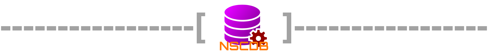

[![Contributors][contributors-shield]][contributors-url]
[![Forks][forks-shield]][forks-url]
[![Stargazers][stars-shield]][stars-url]
[![Issues][issues-shield]][issues-url]
[![MIT License][license-shield]][license-url]
[![NPM][version-shield]][npm-url]
[![Downloads][downloads-shield]][npm-url]


<br />
<p align="center">
  <a href="https://github.com/nsc-de/js-database">
    
  </a>

  <h3 align="center">JS Database (aka NSCDB)</h3>

  <p align="center">
    <i>A simple lightweight package to manage data</i>
    <br />
    <a href="https://github.com/nsc-de/js-database/wiki/"><strong>Explore the docs »</strong></a>
    <br />
    <br />
    <a href="https://github.com/nsc-de/js-database/wiki/Node-Quickstart">Quickstart</a>
    ·
    <a href="https://github.com/nsc-de/js-database/issues/new?assignees=&labels=&template=bug_report.md&title=">Report Bug</a>
    ·
    <a href="https://github.com/nsc-de/js-database/issues/new?assignees=&labels=&template=feature_request.md&title=">Request Feature</a>
  </p>
</p>


<!-- TABLE OF CONTENTS -->
## Table of Contents

* [About the Project](#about-the-project)
  * [Built With](#built-with)
  * [Dependencies](#dependencies)
    * [Optional Dependencys](#optional-dependencies)
    * [Development Dependencys](#development-dependencies)
* [Getting Started](#getting-started)
  * [Prerequisites](#prerequisites)
  * [Installation](#installation)
* [Usage](#usage)
* [Roadmap](#roadmap)
* [Contributing](#contributing)
* [License](#license)
* [Contact](#contact)


<!-- ABOUT THE PROJECT -->
## About The Project


### Built With

* [Node](https://nodejs.org/en/)
* [Typescript](https://www.typescriptlang.org/)

### Dependencies

#### Optional Dependencies
* [js-yaml](https://www.npmjs.com/package/js-yaml)@^[3.14.0](https://www.npmjs.com/package/js-yaml/v/3.14.0) - the package has an integrated adaptor for yaml using this package (install if you want to use yaml)

#### Development Dependencies
* [@types/js-yaml](https://www.npmjs.com/package/@types/js-yaml)@^[3.12.5](https://www.npmjs.com/package/@types/js-yaml/v/3.12.5) - typings for js-yaml
* [@types/node](https://www.npmjs.com/package/@types/node)@^[14.10.1](https://www.npmjs.com/package/@types/node/v/14.10.1) - typings for node
* [chai](https://www.npmjs.com/package/chai)@^[4.2.0](https://www.npmjs.com/package/chai/v/4.2.0) - assertions for tests
* [mocha](https://www.npmjs.com/package/mocha)@^[8.1.3](https://www.npmjs.com/package/mocha/v/8.1.3) - all tests are written using mocha
* [source-map-support](https://www.npmjs.com/package/source-map-support)@^[0.5.19](https://www.npmjs.com/package/source-map-support/v/0.5.19) - show errors in typescipt
* [typescript](https://www.npmjs.com/package/typescript)@^[4.0.3](https://www.npmjs.com/package/typescript/v/4.0.3) - the typescript compiler


<!-- GETTING STARTED -->
## Getting Started

To get the package up and running follow these simple steps.

### Prerequisites

You should have npm to install this package

* npm
```sh
npm install npm@latest -g
```

### Installation

1. Install the package
```sh
npm i nscdb
```


<!-- USAGE EXAMPLES -->
## Usage


_For more examples, please refer to the [Documentation](https://example.com)_


<!-- ROADMAP -->
## Roadmap

See the [open issues](https://github.com/nsc-de/js-database/issues) for a list of proposed features (and known issues).


<!-- CONTRIBUTING -->
## Contributing

Contributions are what make the open source community such an amazing place to be learn, inspire, and create. Any contributions you make are **greatly appreciated**.

1. Fork the Project
2. Create your Feature Branch (`git checkout -b feature/AmazingFeature`)
3. Commit your Changes (`git commit -m 'Add some AmazingFeature'`)
4. Push to the Branch (`git push origin feature/AmazingFeature`)
5. [Open a Pull Request](https://github.com/nsc-de/js-database/compare)


<!-- LICENSE -->
## License

Distributed under the BSD2-Clause License. See `LICENSE` for more information.


<!-- CONTACT -->
## Contact

Project Link: [https://github.com/nsc-de/js-database](https://github.com/nsc-de/js-database)


<!-- MARKDOWN LINKS & IMAGES -->
[contributors-shield]: https://img.shields.io/github/contributors/nsc-de/js-database.svg?style=flat-square
[forks-shield]: https://img.shields.io/github/forks/nsc-de/js-database.svg?style=flat-square
[stars-shield]: https://img.shields.io/github/stars/nsc-de/js-database.svg?style=flat-square
[issues-shield]: https://img.shields.io/github/issues/nsc-de/js-database.svg?style=flat-square
[license-shield]: https://img.shields.io/github/license/nsc-de/js-database.svg?style=flat-square
[version-shield]: https://img.shields.io/npm/v/nsc-de/js-database.svg
[downloads-shield]: https://img.shields.io/npm/dt/nsc-de/js-database.svg

[contributors-url]: https://github.com/nsc-de/js-database/graphs/contributors
[forks-url]: https://github.com/nsc-de/js-database/network/members
[stars-url]: https://github.com/nsc-de/js-database/stargazers
[issues-url]: https://github.com/nsc-de/js-database/issues
[license-url]: https://github.com/nsc-de/js-database/blob/master/LICENSE
[npm-url]: https://www.npmjs.com/package/nsc-de/js-database